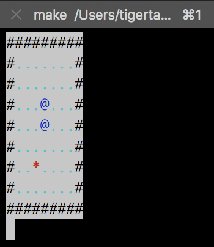

# A snake running in compiling time

It's a compiling time snake as is mentioned in the title. Nearly all game logics are implemented within `C++`'s compiling time while the `python` script are used only to render the map, generate food locations and transfer necessary data.

## Prerequisite

- Python3
- A third party python package `click`, installed by `pip`
- `boost.format`
- `-std=c++11`

## Usage

1. Change directory to `build` and run `make init`
2. `make run`

## Screen shot

